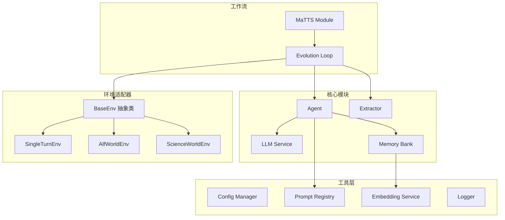
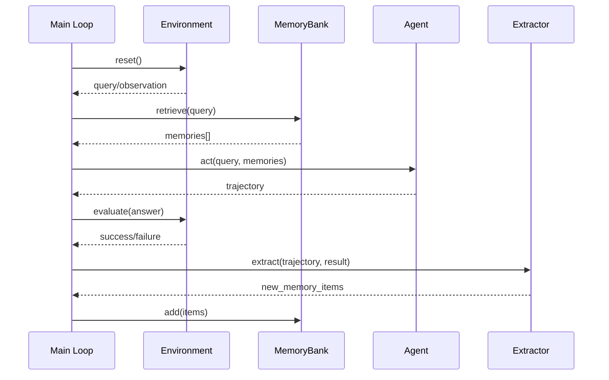

# ReasoningBank 复现项目实现计划

## 项目架构设计



## 目录结构

```
reasoning_bank/
├── config/
│   └── config.yaml              # 统一配置文件
├── core/
│   ├── __init__.py
│   ├── llm_service.py           # LLM调用封装（复用llms_api）
│   ├── memory.py                # ReasoningBank 记忆库
│   ├── agent.py                 # ReAct Agent实现
│   └── extractor.py             # 记忆提取器（Judge + Distill）
├── envs/
│   ├── __init__.py
│   ├── base.py                  # 环境抽象基类
│   ├── single_turn.py           # 单轮QA环境适配器
│   ├── alfworld_env.py          # ALFWorld适配器
│   └── scienceworld_env.py      # ScienceWorld适配器
├── prompts/
│   ├── __init__.py
│   └── registry.py              # Prompt模板注册表
├── workflows/
│   ├── __init__.py
│   ├── evolution.py             # 进化循环主流程
│   └── matts.py                 # MaTTS扩展模块
├── utils/
│   ├── __init__.py
│   ├── embedding.py             # Embedding服务
│   ├── logger.py                # 日志工具
│   └── answer_parser.py         # 答案解析器
├── data/
│   └── memory_banks/            # 各数据集的记忆库存储
├── logs/                        # 运行日志
├── main.py                      # 入口文件
└── requirements.txt             # 依赖管理
```

## 核心模块设计

### 1. 配置管理 (`config/config.yaml`)

```yaml
llm:
  api_base: "${OPENROUTER_API_BASE:https://openrouter.ai/api/v1}"
  api_key: "${OPENROUTER_API_KEY}"
  default_model: "deepseek/deepseek-chat-v3-0324"
  temperature: 0.3
  max_tokens: 4096

embedding:
  model: "sentence-transformers/all-MiniLM-L6-v2"
  
memory:
  top_k: 1
  storage_path: "./data/memory_banks"

agent:
  max_steps: 30
  
matts:
  parallel_n: 5
  parallel_temperature: 0.7
```

### 2. 环境抽象基类 (`envs/base.py`)

定义统一接口 `BaseEnv`，包含：

- `reset() -> observation`
- `step(action) -> (observation, reward, done, info)`
- `get_ground_truth() -> answer`
- `evaluate(prediction) -> bool`
- `get_task_type() -> str` (single_turn / multi_turn)

### 3. 记忆库 (`core/memory.py`)

数据结构（JSONL存储）：

```python
@dataclass
class MemoryItem:
    id: str
    original_query: str
    query_embedding: List[float]
    items: List[dict]  # [{title, description, content}]
    source_trajectory_id: str
    is_success: bool
    timestamp: str
```

核心方法：

- `retrieve(query, top_k=1) -> List[MemoryItem]`
- `add(query, trajectory, extracted_items, is_success)`
- `save() / load()`

### 4. 记忆提取器 (`core/extractor.py`)

两阶段处理：

1. **Judge**: 判断任务成功/失败（优先规则判定，无GT时LLM-as-Judge）
2. **Distill**: 根据结果调用不同Prompt提取记忆

   - 成功 -> 提取通用策略
   - 失败 -> 提取反事实教训

### 5. Prompt注册表 (`prompts/registry.py`)

集中管理所有Prompt模板：

- `SYSTEM_WITH_MEMORY`: Agent系统提示（含记忆注入槽位）
- `JUDGE_PROMPT`: LLM判题
- `EXTRACT_SUCCESS_PROMPT`: 成功策略提取
- `EXTRACT_FAILURE_PROMPT`: 失败教训提取
- `MATTS_CONTRAST_PROMPT`: 对比提取
- `MATTS_CHECK_PROMPT`: 自我检查

### 6. MaTTS模块 (`workflows/matts.py`)

- **并行扩展**: N个Agent并发执行 + Self-Contrast提取
- **串行扩展**: 检查模式 + Self-Refine提取

## 数据流示意



## 关键实现文件

| 优先级 | 文件 | 说明 |

|--------|------|------|

| P0 | [`config/config.yaml`](config/config.yaml) | 配置文件 |

| P0 | [`core/llm_service.py`](core/llm_service.py) | 封装现有llms_api，支持异步 |

| P0 | [`envs/base.py`](envs/base.py) | 环境抽象基类 |

| P0 | [`envs/single_turn.py`](envs/single_turn.py) | 单轮QA适配器 |

| P0 | [`core/memory.py`](core/memory.py) | 记忆库核心 |

| P1 | [`prompts/registry.py`](prompts/registry.py) | Prompt管理 |

| P1 | [`core/agent.py`](core/agent.py) | ReAct Agent |

| P1 | [`core/extractor.py`](core/extractor.py) | 记忆提取器 |

| P1 | [`workflows/evolution.py`](workflows/evolution.py) | 主循环 |

| P2 | [`envs/alfworld_env.py`](envs/alfworld_env.py) | ALFWorld适配（基于现有测试脚本重构） |

| P2 | [`envs/scienceworld_env.py`](envs/scienceworld_env.py) | ScienceWorld适配 |

| P2 | [`workflows/matts.py`](workflows/matts.py) | MaTTS模块 |

| P3 | [`utils/answer_parser.py`](utils/answer_parser.py) | 答案解析（数学表达式等） |

| P3 | [`main.py`](main.py) | CLI入口 |

## 实现顺序

1. **基础框架搭建**: 配置管理、目录结构、LLM服务封装
2. **环境适配层**: BaseEnv + SingleTurnEnv（先跑通单轮QA）
3. **记忆核心**: MemoryBank + Embedding服务
4. **Agent与提取器**: ReAct Agent + Extractor
5. **主循环**: Evolution Loop（完成闭环）
6. **多轮环境**: ALFWorld/ScienceWorld适配
7. **MaTTS扩展**: 并行/串行扩展
8. **测试与优化**: 端到端测试、日志完善